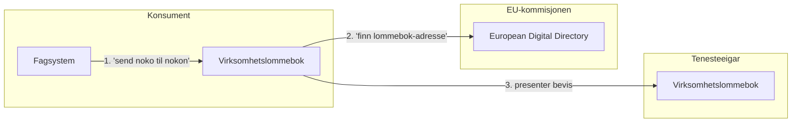
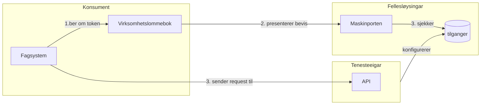

# Mønstre

## 0: lommebok-til-lommebok

Dette er anteke det normale bruksmønstere for virksomheitslommeboka.  Ingen behov for Maskinporten.

## 1: Tradisjonell API-bruk 

Tenesteeigar har eit eksisterande API som er sikra med Maskinporten, ynskjer å kunne dele også med "virksomhetslommebok".

utfordringar:
- kva bevis er det som mappar til tenesteeigar sitt scope ?
- skal scope-tilganger framleis ligge i Maskinporten?

- har også ein variant #1b,  der fagsystemet snakkar først med lommmeboka for å få ein presetnasjon, for deretter å videresende denne til Maskinporten.  Litt rar?

## 2: Tradisjonell API-bruk 

Variant der fagsystemet Tenesteeigar har eit eksisterande API som er sikra med Maskinporten, ynskjer å kunne dele også med "virksomhetslommebok".

