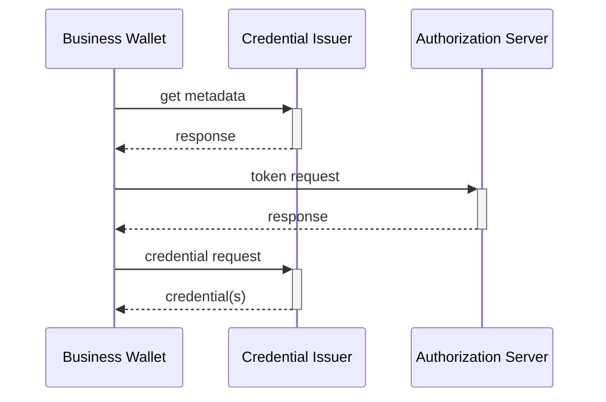

# Prerequisites

1. The issuance is automatic without human control; it can however be triggered by an authorized employee logging into the EBW and performing some GUI action, or the employee may have set up automation rules earlier which triggers automated issuance at a later stage.
2. How employees log in to the EBW is out-of-scope for the VCI protocol, and is up to the discretion of the EBW-provider.  It can f.ex be based on presenting a PoR from their identity wallet.
3. How the EBW discovers which issuer is the correct issuer for a specific credential is out-of-scope for the VCI protocol,  it can f.ex be looked up in a centralized Catalogue.
4. The EBW knows the `iss` value of the correct credential issuer.

# Steps

The flow is a simplied openid4vci flow where the end-user/browser parts are omitted, since there is no need to ensure that a human is in the loop to collect consent and exercise "sole control" according to eIDAS2.

1. The Business Wallet fetches the credential metadata of the Credential Issuer from the well-known endpoint, based on `iss`.
2. The Business Wallet makes a token request toward the token endpoint.  In this request the business wallet:
   - Authenticates itself using the EBWOID
   - Identifies the requested credential(s), ex. based on metadata from step #1
   - Optionally includes a WUA from the EBW-provider to prove that the EBWOID resides in an authentic EBW.
3. The Credential Issuer validates the request and returns an access token.
4. The Business Wallet makes a credential request to the credential endpoint.
5. The Credential Issuer returns the credential(s).




Using this approach, the same mental model as well as protocol exchange is used for credential issueing both to Identity and Business wallets.

Comparing against EUDIW, this draft proposes the following changes:
- the authorization endpoint and credential offers are not used as they are not needed
- we foresee no or minimal changes to the credential endpoint
- the JWT that the EBW use to authenticate itself towards the token endpoint must be profiled/standardized


# Example

TBD  MÅ PRØVE Å FORENKLE.   BURDE VERE GODT NOK Å BERRE SENDE EBWOID MED SIGNATUR SOM BEVISER HOLDER BINDING.


If attestation-based client authentication is used with WUAs, a token request might look
token request
```
POST /token

grant_type=urn:eu:ebw
&scope=some_credential
&client_assertion_type=urn%3Aietf%3Aparams%3Aoauth%3Aclient-assertion-type%3Ajwt-bearer
&client_assertion=eyJhbGciOiJSU...
```
where the JWT looks like:
```
{
 "typ": "oauth-client-attestation+jwt",
}.{
 "sub": "https://wallet-provider.com/an_ebw_customer"
 "cnf": <the ebwoid key>
 
 
}.<signature, by ebwoid key>
```


# More details 

- The Oauth2 and OpenID protocols have already well-established features for machine-to-machine authorization, with large deployed ecosystems within e.x. OpenBanking and eHealth ecosystems around the world.   These features can easily be applied also to VP and VCI, yielding simplified protocols, which is what we propose in this draft.

- The feature set selected for FAPI should be guidance, as they have passed rigorous security analysis by researchers, ex. by using formal methods.

- There is a need to agree upon high-level requirements for the EBWOID and the WUA for credential issuance, as this will affect protocol design.  How do the EBW authenticate itself ?
   1. Only use the EBWOID.  Ie: Issuers will implicitly trust that EBWOIDs never leaks from a geniune EBW (or dont care) and cannot know that the credential they issue is stored in a genuine EBW. 
   2. Only use WUAs, and just include the identifier of the EBWOID as a claim the request. (ie: trust the EBW-provider) 
   3. EBW must include both a fresh WUA and prove possession of the EBWOID key material in the request
 
- holder binding:  can we simplily the requirements from EUDIW where every credential is issued in privacy-preserving batches having unique key material ?   Can we bind all credentials instead to the EBWOID key ?

- Should WRPAC and / or WRPRC be used also by the EBW when requeting a new credential  ?

- We assume that WRPAC and WRPRC are used by the Issuer in the same manner as for EUDIW (ie: put WRPRC inside metadata and sign it using WRPAC)

- If [RFC 7523](https://datatracker.ietf.org/doc/rfc7523/) is selected for client authentication rather than EUDIWs choice of [attestation based](https://datatracker.ietf.org/doc/draft-ietf-oauth-attestation-based-client-auth/)  it seems wise to introduce a new oauth2 grant type (`urn:eu:ebw`) profiling which claims must be present in the request JWT.
  
