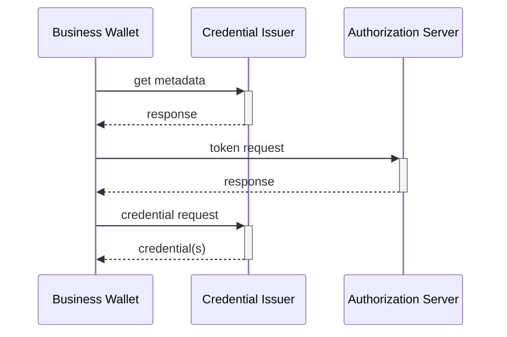

# Scenario

A Business Wallet Instance requests the issuance of a credential from a *EAA-provider (issuer).

# Prerequisites

1. The issuance is automatic without human control; it can however be triggered by an authorized employee logging into the EBW and performing some GUI action, or the employee may have set up automation rules earlier which triggers automated issuance at a later stage.
2. How employees log in to the EBW is out-of-scope for the VCI protocol, and is up to the discretion of the EBW-provider.  It can f.ex be based on presenting a PoR from their identity wallet.
3. How the EBW discovers which issuer is the correct issuer for a specific credential is out-of-scope for the VCI protocol,  it can f.ex be looked up in a centralized Catalogue.
4. The EBW knows the `iss` value of the correct credential issuer.

# Steps

The flow is a simplied openid4vci flow where the end-user/browser parts are omitted, since there is no need to ensure that a human is in the loop to collect consent and exercise "sole control" according to eIDAS2.

1. The Business Wallet fetches the credential metadata of the Credential Issuer from the well-known endpoint, based on `iss`.
2. The Business Wallet makes a token request toward the token endpoint.  In this request the business wallet:
   - Authenticates itself using the EBWOID
   - Identifies the requested credential(s), ex. based on metadata from step #1
   - Optionally includes a WUA from the EBW-provider to prove that the EBWOID resides in an authentic EBW.
3. The Credential Issuer validates the request and returns an access token.
4. The Business Wallet makes a credential request to the credential endpoint.
5. The Credential Issuer returns the credential(s).




Using this approach we can have the same mental model,  as well as protocol exchange, for issuing credentials both to Identity and Business wallets.

Comparing against EUDIW, this draft proposes the following changes:
- the authorization endpoint and credential offers are not used as they are not needed
- we foresee no or minimal changes to the credential endpoint
- the JWT that the EBW use to authenticate itself towards the token endpoint must be profiled/standardized


# Authentication of the wallet

The main open question in this proposal is how the business wallet instance authenicates itself towards the issuer.  Here, eventually, guidance from the coming Regulation and implementing acts needs to be considered, in order to create high-level requirement in a coming ARF, which then can be used for protocol design.

Nevertheless, some options are discussed below:

### Option 1: Present the EBWOID

The wallet authenticates by presenting its EBWOID to the Issuer. 
```
POST /token

grant_type=verifiable_presentation
&scope=requsted_credentials
&vp_token=["eyJhbGciOiJSU...", "other presentations", ...]
```
Here, a new grant_type is introduced, profiling which claims that must be in the request. The current proposal only intoduces a `vp_token` claim, where the wallet must include the presentation of credential(s) needed to satisfy issuer requirements. Rules for `vp_token` should be identical to its use in Openid4VP. 

In the normal case, the vp_token will contain an EBWOID in SD-JWT VC-format, including a key binding JWT which demonstrates that the Holder has proof-of-possession of the EBWOID key material.

### Option 2: WUA

Here, the Wallet instance includes a WUA from the Wallet Provider, attesting that the request comes from a valid EBW-instance. The request should also identify the EBW owner, which could be either by reference, or by also  proving posession of the EBWOID.

### Option 3: Using WRPAC

Another option might be to leverage Wallet-Relying Parties Access Certificates.  As the EBW probably need to be provisioned with WRPACs to act as a Verifier during VP-flows, it can then be beneficial to also use the WRPAC for authentication when the EBW is acting as a Holder.


# Motivation:

- The Oauth2 and OpenID protocols have already well-established features for machine-to-machine authorization, with large deployed ecosystems within e.x. OpenBanking and eHealth ecosystems around the world.   These features can easily be applied also to VP and VCI, yielding simplified protocols, which is what we propose in this draft.

- The feature set selected for FAPI should be guidance, as they have passed rigorous security analysis by researchers, ex. by using formal methods.

# Open issues:

- **Holder binding:**  For EUDIW, there is a significant complexity coming from privacy protections, where every credential is issued batches where each credential issue must have unique key material.  For EBW, can we instead bind all credentials to the same EBWOID key ?  Do we need batch issuance ?

- We assume that WRPAC and WRPRC are used by the Issuer in the same manner as for EUDIW (ie: put WRPRC inside metadata and sign it using WRPAC)

  
