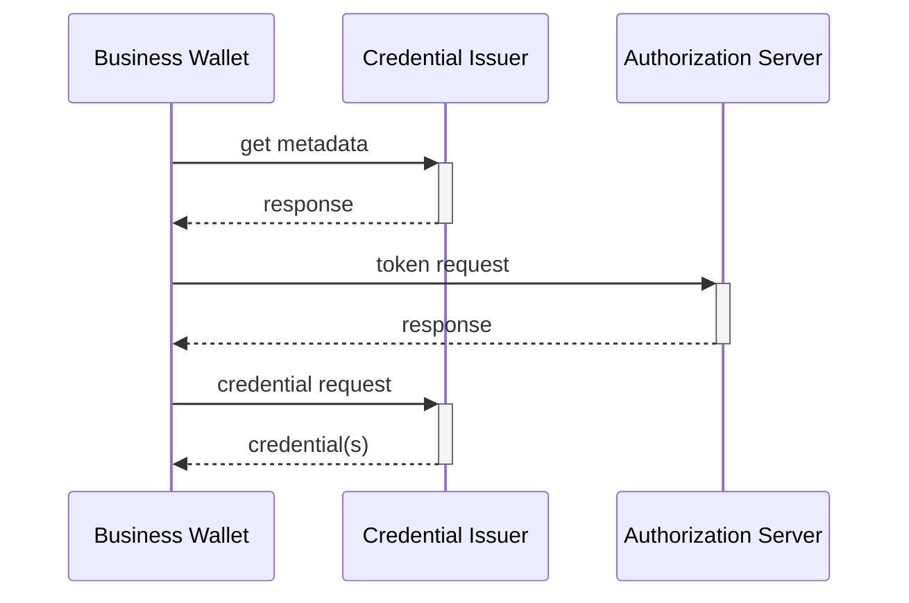

# Prerequisite

1. An authorized employee logs into the business wallet, and either initiates a request for a specific credential, or set up automation rules which triggers later.
2. Identity and Access Managmenet (IAM) for employees logging into the business wallet, is out-of-scope.  It can f.ex be based on presenting a PoR from their identity wallet.
3. How the EBW discovers who is the correct issuer for the specific credential is out-of-scope,  it can f.ex be looked up in a centralized Catalogue.
4. The EBW knows the `iss` value of the correct credential issuer.

# Steps

The flow is a slightly modified openid4vci flow where the end-user/browser parts are omitted, since there is no need to ensure that a human is in the loop to collect consent and exersise sole control.

1. The Business Wallet fetches the credential metadata of the Credential Issuer from the well-known endpoint, based on `iss`.
2. The Business Wallet makes a token request toward the token endpoint.  In this request the business wallet:
   - Includes the EBWOID
   - Proves possession of the EBWOID key
   - Includes the oauth2 `scope` value identifying the specific credential.
   - Optionally includes a WUA from the EBW-provider
3. The Credential Issuer validates the request and returns an access token.
4. The Business Wallet makes a credential request to the credential endpoint.
5. The Credential Issuer returns the credential(s).



There are the following changes compared to the EUDIW-profile of VCI: 
- the authorziation endpoint and credential offers are not used
- no foreseen changes to the credential endpoint
- relatively small changes to the token endpoint

The benefits of this approach is that issuance towards identity and business wallets will be very similiar.

# Example

token request
```
POST /token

grant_type=urn:eu:ebw
&scope=some_credential
&client_assertion_type=urn%3Aietf%3Aparams%3Aoauth%3Aclient-assertion-type%3Ajwt-bearer
&client_assertion=eyJhbGciOiJSU...
```
where the JWT looks like:
```
{
 "x5c": 
}.{
}.<signature, by ebwoid key>


# Details (TBA)

- it is probably wise to introduce a new oauth2 grant type (`urn:eu:ebw`) for this use, profiling which claims need to be in the token request JWT.
- WUAs 
- 
