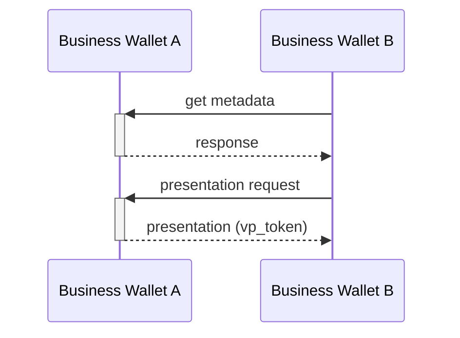

# Scenario

A Business Wallet Instance A presents credentials to another Business Wallet Instance B

# Prerequisites

1. The presentation is automatic without human control; it can however be triggered by an authorized employee logging into the EBW and performing some GUI action, or the employee may have set up automation rules earlier which triggers automated presentation at a later stage.
2. How employees log in to the EBW is out-of-scope for the VP protocol, and is up to the discretion of the EBW-provider.  It can f.ex be based on presenting a PoR from their identity wallet.
3. The EBW initiating the protocol uses the European Digital Directory to find the endpoint (`iss` value) of the other EBW.

There are 2 variants of this scenario to consider:

# Variant 1: Verifier-initiated flow

This variant is similar to regular VP, which is always Verifier-initiated. Ie: EBW B asks EBW A for a credential.

1. The Business Wallet B fetches the client metadata of the Business Wallet A from the well-known endpoint, based on `iss`.
2. The Business Wallet B creates a presentation request (ie. authorization request) towards A's authorization endpoint.
3. Business Wallet A validates the request and returns a presentation response (vp_token)

The flow is a simplied openid4vp flow where the end-user/browser parts are omitted, since there is no need to ensure that a human is in the loop to collect consent and exercise "sole control" according to eIDAS2.

Comparing against EUDIW, this draft proposes the following changes:
- browser redirects and/or the DC API are not used as they are not needed
- business wallet instances can publish their [client metadata on a well-known endpoint](https://datatracker.ietf.org/doc/draft-ietf-oauth-client-id-metadata-document/) and signing keys.  The EBWOID public key could be included in the metadata.

# Variant 2: Wallet-initiated flow

This flow is simply the reverse of variant 1; ie EBW A sends a presentation directly to EBW B.

This variant could alternatively be solved by adding an initial step to Variant A, in which EBW A firsts asks EBW B to "please, can you ask me to present a credential".  

# Authentication of the verifier

### Option 1: Using WRPAC

Here, EBW instances uses a WRPAC for authenticaing the presentation request, by selecting `x509_hash` as Client Identifier Prefix, similar to normal EUDIW operation.   It is TBD if WRPRC (registration certififates) are also needed, depending on the coming Regulation, but we think they can be skipped as there is not personal data requested and no need to registrer the intent according to GDPR.

In this option, the EBWOID is not used. 

### Option 2: Using EBWOID directly

This may be a simpler option because EBW instances doesn't need to also get WRPACs.  The authorization request is signed with the EBWOID key. 

The Client Identifier Prefix could be `verifier_attestation`.  Note that this option place some requirements on the EBWOIDs: they must be in SD-JWT format, and some claims should be non-selectively disclosurable, namely `sub` (which should be set to the EU-ID, and used as original client identifier), `iss` (which is a qualified EAA provider) and `cnf` for the holder binding.   Also; how `iss` values should correspond to the Trust Services (QEAA-providers issuing EBWOID) on the Trust List must be solved. 

### Option 3: Wallet-provider attestation

Same as option 2, only that instead of EBWOID, we use an attestation signed by the Business Wallet-provider.  Trust List resolution might be simpler here, as Wallet Providers shall be put on the new ETSI 119 602 (json-based) trust lists and not ETSI 119 612 (xml, already used by eidas1). Thus, it could potentially be easier to extend / profile ETSI 119 602 to also include `iss` values of Trusted Entities, in addidition to signing keys.

# Open issues:

- Since all EBWs are online services with resolvable DNS (no mobile app), it seems beneficial that they also host their own client metadata, so that the other party can query their capabilities before initiating protocol exchange.
