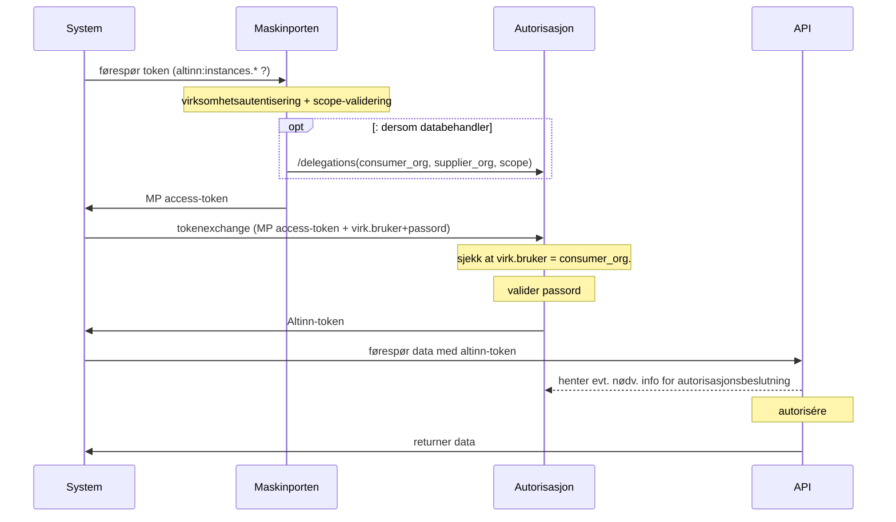
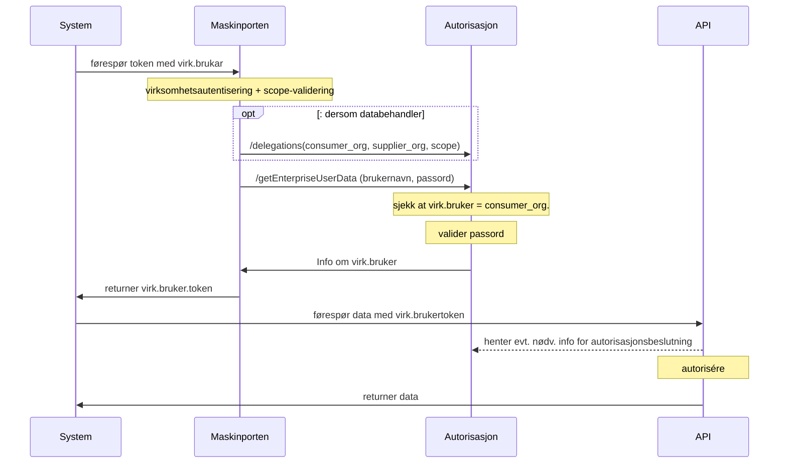
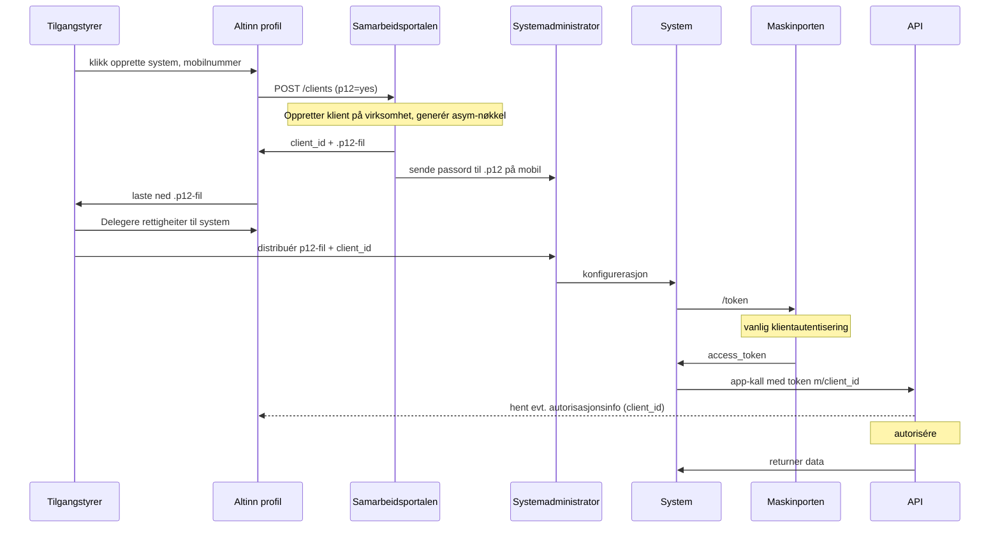
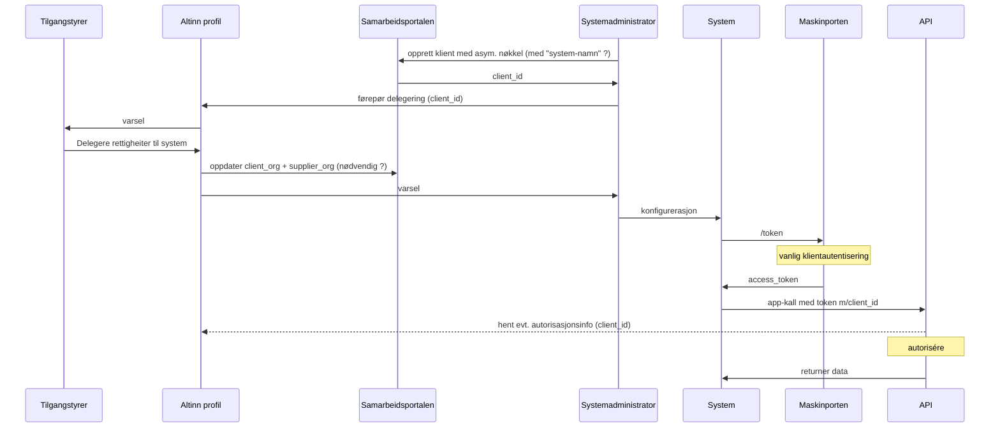

# Samspel Maskinporten og Virksomhetsbrukere

Kan me forbetre samspelet mellom Maskinporten og virksomheitsbrukarane i Altinn?


## Dagens løysing

Konsument må token-veksle eit Maskinporten-token mot Altinn platform for å få eit Altinn-token.





## Alt 1:  Virksomhetsbruker som ny token-type:

I dette alternativet vert Maskinporten utvida til å gje ut ein ny type "virksomhetsbruker-token"
* dersom konsument har gyldig scope, vil Maskinporten sende kall til Autorisasjon om virk.bruker-autentisering
* virk.bruker-tokenet har sme innhald som etter dagens tokenutveksling, og det er Autorisasjon som utfører all valideringslogikken for virk.brukaren.



**Request:**

Me nyttar Maskinporten med grunnleggjande JWT-grants på vanleg måte, men innfører RAR sin `authorization_details` som nytt claim i request, for å førespørre denne type token.

Kun to attributter trengs sendast:  brukarnamn og passord

```
{
  "iss": "<min_clientid>",
  "aud": "https://maskinporten.no/",
  "resource": [ "https://altinn.no", "https://skatteetaten.no" ],
  "scope": "altinn:xxx"                            // i utgangspunktet heilt uavhengig av RAR-tilgangskontrollen.

  "authorization_details": [
    {
      "type":      "urn:altinn:enterpriseuser",        // treng MP tilgangstyre RAR-typen?
      "username":  "sdfkjsskfjlasfsdalfkjsa",
      "password":  "skikkeleg_hemmeleg_altso"
    }
  ]

```

**Response**

Ein vanleg maskinporten-token men utvida med ein respons-datamodell tilhøyrande av auth_typen (bestemt av autorisasjon):

```
{
  "iss": "https://maskinporten.no",
  "aud": ["https://altinn.no", "https://skatteetaten.no"]
  "client_id": "<min_clientid>",
  "scope": "altinn:xxx",
  "consumer": {

  }
  "authorization_details": [{
      "type": "altinn:enterpriseuser",
      "org": "brg",
      "orgNumber": 974760673,
      "iss": "https://platform.altinn.cloud/",
      "AuthenticateMethod": "maskinporten",
      "AuthenticationLevel": 3,
   }]
}
```

spm
* er det verkeleg berre org og orgNummer som blir resultatet av ein tokenveksling?   
  * Eller er dømet i doc'en ufullstendig? https://docs.altinn.studio/api/scenarios/authentication/#the-altinn-jwt-access-token-output.
  * er det nokon samanheng med "partyid" i respons ved token-utveksling for personer?  (og kunne desse to vore slått saman ? )

* vert det i praksis berre inkludert ein "peikar" i tokenet, som Altinn-API sjølv veit korleis skal autoriserast. Eigentleg ingen fin-korna autorisasjonsinfo i sjølve tokenet?

#### omfang:
- MP må støtte for "ruting" basert på auth-type, nytt kall mot Autorisasjon
- MP kanskje innføre sjølvbetjeningsløysing for auth-types?  Eller kan me klare oss med eit scope for dette?
- Få(?) endringer i autorisasjon


## Alt 2: Maskinporten-integrasjon erstatter virksomhetsbruker

Her blir virksomhetbrukere implementert som (maskinporten)-integrasjonar, og handlingar i Altinn medfører kall til sjølvbetjenings-APIet til Maskinporten.

Når tilgangstyrer/hovedadministrator/innbygger sjølv er innlogga i Profil, kan vedkommande opprette eit "system" (finn evt. på nytt menneskevenleg namn)
Det blir då oppretta ein ny integrasjon i Samarbeidsportalen, med asymmetrisk nøkkel, knytt til virksomheten, og med Altinn som `supplier`.  

api-klient = "Person-system"
maskinporten="Maskin-system" ?



omfang:
* Samarbeidsportalen må støtte nøkkelgenerering og passord-utsending
* Evt. utvidingar i metadata/klientmodell MP
*


* kva rolle fyller dagens virk.bruker.passord - trengs dette når vi har asym. nøkler?
* kva rolle fyller API-KEY - trengs denne ?
* trengs det meir metadata knytt til ein integrasjon som bør lagrast i Maskinporten?  
* Bør "virksomhetsbruker" bli ein eigen integrasjonstype i MP ?
* dekker dagens "supplier"-funksjonalitet det som trengs?
* risiko for at sjølvbetjener i ei verksemd "ser" ein virk.bruker i Altinn og sletter denne uforvarande ?
* nøkkelhandtering kan bli komplekst: forstår Tilgangsstyrer kva ei nøkkel-fil er og at den må haldast hemmeleg?  Alternativt kan Tilgangstyrar laste opp ein public-nøkkel som hen får frå systemadministrator, men er dèt forståeleg?
  * bør helst unngå å opne for bruk av client_secret


### Variant 2b: Leverandør-oppretta "virksomhetsbrukere"

Som ovanfor, men her er det systemleveandøren som oppretter klient, og førespør frå tilgangstyrer at den skal få tilgangar  hjå kunde (dvs. konsument).

Sekvensdiagrammet vert mykje som i førre avsnitt, men startar hjå systemleverandøren (=systemadminostrator)




## Alt 3: Ny nasjonal tillitstjeneste for systemer

Det bør vurderes om mønsteret skal løftast, anten ved å lage ein ny nasjonal fellesløysing for utstedelse av systembrukere, eller om ein skal nøye seg med å forskriftsfeste ein tillitsmodell for slik utstedelse (dvs. ein nasjonal tillitsteneste der dei ulike aktørane kan sjølvdeklarere at dei føl gitte kvalitetskriteria for prosessane i løysinga. Sjølvdeklarerte løysinga må underleggjast tilsyn og kontroll av NKOM)

Som ny fellesløysing, kan ein til dømes ta utgangspunkt i sjølvbetjeninga i Maskinporten kombinert med Felles Datakatalog til å registere systembrukere med identifikatorer og system-nøklar som kan nyttast nasjonalt, mot både offentleg og privat.  Det må lagast ei ttilhøyrande oppslagstjeneste for signering- og krypteringsertifikater for asynkron meldingsutveksling.

Kan også vere ei heilt og ny sjølvstendig teneste, slik som OpenBanking gjer i UK.

Sjå også utdanningssektoren sine innspel til Skate sin høyring om Felles Datakatalog


# vurdering

Alle alternativa medfører at Maskinporten byrjar å utføre, i sambeid med Autorisasjon, fin-granulert tilgangskontroll for Altinn-API og evt.  3jdeparts-API som følger Autorisasjon sin "tilgangsmodell".   Dette er ei arkitekturmessige endring frå dagens bevisste avgrensing til grov-granulert tilgangskontroll.  Kan føre til "formålsutglidning" - eit "rush" av kunder som ønsker sin eigen auth-type?

Korleis heng løysingsval saman med merkantil modell?  Sidan alle verksemder kan opprette virk.brukere i Altinn, betyr det at dei automatisk må få bli kunde av alle fellesløysingar?  Eller at det berre er Tenesteeigarar som kan motta virk.bruker.token ?


Alt 2 ser ut til å skape ein tettare kobling mellom Autorisasjon og Maskinporten -


#### forhold til div. delegerings-funksjonalitet

Alt 1: legg kanskje meir opp til delegering via utlån?  (kunde gir virk.bruker m/passord til lev. utan at dette er sporbart.)

Alt 2b-varianten gjev god teknisk og operasjonell sikkerheit. Vidarefører den same arbeidsflyten som "delegering av maskinporten-api" har innført. Slepp utveksle hemmeligheiter/sertifikat mellom fekke

* Dette er eigentleg bere 1 tilfelle av delegering.  Bør sjå strukturert på alle dei variantane i word-dokumentet ifm "dialogporten".


#### andre aspekt

* få tekniske enderingar
* Autorisasjon må tilby omlag same endepunkt som før
* Skal MP utfører tilgangskontroll på "auth_type" ?
  * dvs. kva klient skal ha lov til å kalle ein spesifikk auth-type.
  * MP må duplisere scope / scope-access funksjonaliteten og etablere sjølvbetjeningsløysinga (må truleg på plass før eller sidan uansett)
* må vurderast: vidareføre "least-priviledge": token-reqest feiler dersom 1 scope eller 1 auth-type manglerdersom 1 av scopa i request feiler, skal då også ALLE auto-details feile?


### Spm:

token-veksling for MP:
* er det nokon tilfelle der klienten må gjenta
* er det tilfelle med "instans-spesifikk-veksling".
* Har de tenkt på / sett behov for utvidingar av token-exange-endepunkt?  t.d. ulike ulike responser alt etter mål-API (altinn-app-spesifike token)

* må virk.brukeren alltid nyttast saman med mp-token eller sertifikat-auth?  Eller finst det tilfelle der den fungerer isolert?


### Lenker:

https://altinn.github.io/docs/api/rest/kom-i-gang/virksomhetsbrukere/

https://altinn.github.io/docs/api/rest/kom-i-gang/tutorial-sluttbrukersystem/altinn-token/

Altinn 3:

https://docs.altinn.studio/api/authentication/id-porten/

x
