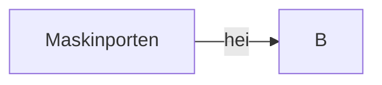

# Maskinporten som token-utsteder for samtykkeløysinga?

Det er tre prosesser knytta til [Samtykkeløsningen](https://altinn.github.io/docs/utviklingsguider/samtykke/) der det kan vere aktuelt å la ID-porten / Maskinporten utføre dei "oauth2-liknande" oppgåvene som skjer i Altinn idag:

1. Sluttbruker inngår samtykke
2. Datakonsument henter token
3. Datakilde validerer token og utleverer data

Me ser først på nr 2 og 3:

## Samtykke-token frå Maskinporten

