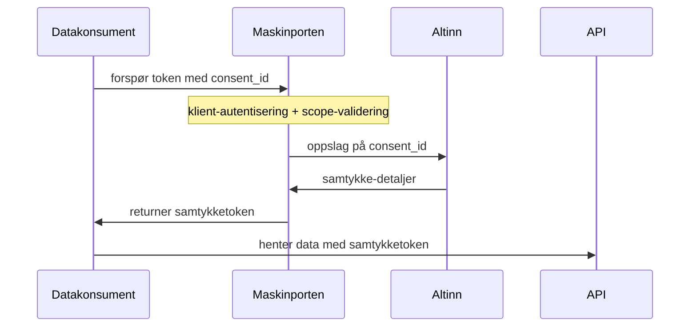

# Maskinporten som token-utsteder for samtykkeløysinga?

Det er tre prosesser knytta til [Samtykkeløsningen](https://altinn.github.io/docs/utviklingsguider/samtykke/) der det kan vere aktuelt å la ID-porten / Maskinporten utføre dei "oauth2-liknande" oppgåvene som skjer i Altinn idag:

1. Sluttbruker inngår samtykke
2. Datakonsument henter token
3. Datakilde validerer token og utleverer data

Me ser først på nr 2 og 3 nedanfor

# Oppsummering av endringer

- Maskinporten blir utsteder av samtykketokens
  - Det nye samtykketokenet innheld då både virksomhetsautentisering, kontroll av databehandler-delegering og det detaljerte samtykket fra innbygger
  - Det nye samtykketokenet er modifisert til å vere meir "oauthsk"
    - `AuthorizationCode` endres til `consent_id`
    - Endrar frå CamelCase til snake_case
    - Omstrukturert ihht. [RAR](https://datatracker.ietf.org/doc/html/draft-ietf-oauth-rar-12) med `authorization_details`-claimet, dvs. endrar frå flate claims til ein array av samtykker per tjenestekode og varigheit.
- Sjølve samtykket persisteres og vert framleis forvalta i Altinn Autorisasjon
  - GUI, tilbaketrekking, etc.

## Prosess 2+3: Samtykke-token frå Maskinporten




**Ved mottak av request** vil Maskinporten sende eit kall til Altinn Autorisasjon for å hente ut sjølve samtykket, validere reponsen, og bygge eit samtykke-token som inneheld både virksomhetsautentisering og samtykke-informasjon i samme token.


### Request:

Her bruker vi Maskinporten med grunnleggande JWT-grants på vanleg måte, men innfører `authorziation_details` som nytt claim i request, og der kvar auth_type trigger custom logikk.

Følgjande scope er naudsynt for å få ut samtykketokens (dvs. gjenbruk av dagens scope)

|claim|skildring|
|-|-|
|scope|Må vere `altinn:consenttokens` |

I tilegg trengs det innførast samtykke-spesifikke element i førespurnaden.   Her ser vi for oss å anten referert til samtykke-instansen vi ein identifikator, eller "indirekte" via oppslag på parts- og tjenstekodeforhold, dvs. anten

|consent_id|Ein unik identifikator på sjølve samtykket.  (Dette vart tidlegare kalla `AuthorizationCode`, men endrar namn for å unngå forvirring med standard oauth-claim)|

eller:

|OfferedBy|Fødselsnummer til sluttbruker. |
|CoveredBy|Orgnummer til datakonsument  (TRENG ME DENNE, KUNNE VORE PLUKKA FRÅ KLIENTAUTNETISERING/delegering?|
|ServiceCode| Tjenestekode som samtykket skal gjelde for. Døme: `"4629"` |
|ServiceEdition| Tjenesteutgave under tjenestekoden. Døme: `"2"` |

Den siste her er noko meir generisk, t.d. viss datakonsument har mista id'en til samtykke-instansen, kan dei nytta grantet som ein oppslagsmekanisme for å sjekka om dei har framleis har samtykke frå brukaren

#### Bruk av databehandler

Bruk av databehandler er basert på den vanlege [delegering i eOppslag-funksjonaliteten i Maskinporten](https://docs.digdir.no/docs/Maskinporten/maskinporten_func_delegering) for kunde-leverandørforhold.

Dvs. databehandlar som skal hente samtykke-tokens på vegne av data-konsument (behandlingsansvarlig), må autentisere seg med eige virksomheitssertifikat/nøkkel mot Maskinporten og be om på-vegne-av-token.  registerere ein maskinporten-klient om brukar eige virksomhetssertifikat/nøkkel klienten som henter token vere registrert på leverandør (databehandler) og bruke eige virksert/nøkkelgrantet i tillegg innehalde:

|claim|skildring|
|-|-|
|consumer_org| Organisasjonsnummer på datakonsument, valgfri, trigger vanleg kontroll av delegering for aktuelt scope|

(ER DET SLIK AT SAMTYKKET ER GJEVE TIL DATABEHANLDAR?  SO VISS BANKEN BYTTAR DATABHENDALAR MÅ INNBYGGAR GJE SAMTYKKE PÅ NYTT?)


#### Feilkoder

Feilmeldinger:

|-|-|
|400|  bad request|
|400| bad request - "noe feil mot altinn"  (truleg feil i Maskinporten og ikkje hjå konsument)|
|404| consent_id not found|
|404| det finst ikkje noko samtykke for kombinasjonen av coveredby og offeredby og servicecode|
|403| forbidden: konsument / leverandør har ikkje lov til å hente samtykketoken|
|40x| leverandør har ikkje lov til å opptre på vegne av konsument (for scope, dvs. hente samtykketokens)|


#### Døme:

```
POST /token HTTP/1.1
Host: maskinporten.no
Content-Type: application/x-www-form-urlencoded

grant_type=urn%3Aietf%3Aparams%3Aoauth%3Agrant-type%3Ajwt-bearer
&assertion=eyJhbG....
```

der grantet (`assertion`) sin body ser slik ut:

```
"aud":"https://maskinporten.no",
"iss": "some_client_id",
"iat": ..
"exp": ..
"jti": ..
"scope": "altinn:consenttokens",
"consumer_org": 999888777         //valgfritt

"authorization_details": [
  { "type": "urn:altinn:samtykke",
    "consent_id": "c7dbe642-0fc1-4c3b-8959-8a92e3e1f17d"
  }
]
```


### Respons

Responsen er er eit samtykke-token frå Maskinporten, der det er utført både virksomhetsautentisering, kontroll av evt.  delegering til leverandør, og berikelse med samtykke-informasjon fra Altinn Autorisasjon.  

Samtykke-informasjonen er modifisert frå dagens samtykketoken, for å vere ihht [RAR-strukturen](https://datatracker.ietf.org/doc/html/draft-ietf-oauth-rar-12):

```
// standard oauth claims:
"iss": "https://maskinporten.no",
"iat": 1503860317,
"exp": 1503860347,
"jti": "a9daa57c-0b68-4ba2-a953-7567a99bd0f0",
"scope": "altinn:consentokens",

// Informasjon om klienten som ba om tokenet, standard Maskinporten-claims:
"client_id": "asdkjflkdsajfsadlf",
"client_amr": "private_key_jwt",
"token_type": "Bearer",
"consumer" : {
   "authority" : "iso6523-actorid-upis",
   "ID" : "0192:910514458"      // alltid lik covered_by
 }
 "supplier" : {
    "authority" : "iso6523-actorid-upis",
    "ID" : "0192:991825827"
  },
"delegation_source": "https://altinn.no",

// Informasjon om sjølve samtykket:
"authorization_details": [
    {
      "type":"urn:altinn:samtykke",
      "service_code": 4629,
      "service_edition": 2,
      "year": 2016,

      "consent_id": "c7dbe642-0fc1-4c3b-8959-8a92e3e1f17d",
      "offered_by": "11025802170",
      "covered_by": "910514458",
      "delegated_date": 1503855661,
      "valid_to_date": 1506760200,
    },
    {
      "type":"urn:altinn:samtykke",
      "service_code": 4630,
      "service_edition": 2,
      "from": "2017-06",
      "to": "2017-08",

      "consent_id": "c7dbe642-0fc1-4c3b-8959-8a92e3e1f17d",
      "offered_by": "11025802170",
      "covered_by": "910514458",
      "delegated_date": 1503855661,
      "valid_to_date": 1506760200,
    }

]
```


# Prosess 1:  Innbyggar inngår samtykke


TBD
