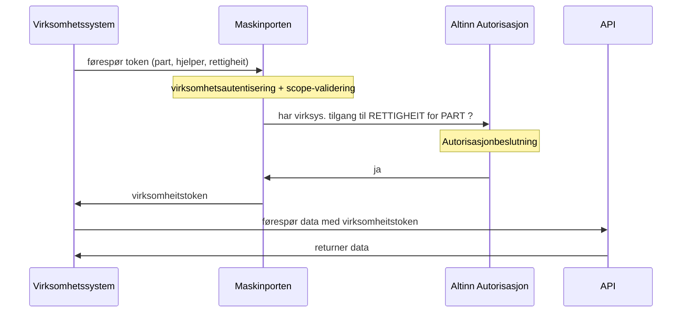
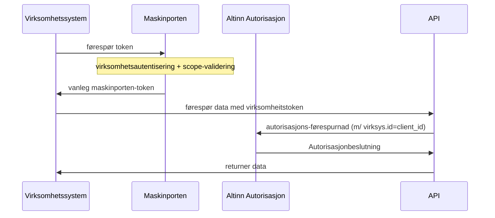

# Virksomhetssystem ber om token

Me ser for oss å støtte to mønster:

* Virksomheitstoken
* "tynne" token

## Virksomheitstoken

Virksomheitstoken er ein ny, "ferdigbakt" tokentype, som fortel basis autorisasjonsinformasjon om kva rettar virksomheitssystemet har fått frå ein Part (som oftast gjennom ein "hjelper")

Flyten er slik:




Virksomheitssystemet må spesifisere at det ynskjer eit slikt type token ved å oppgje RAR-typen `urn:altinn:virksys` i requesten, og vidare kva **part** som token-requesten gjeld, typisk:
```
{
  "aud": "https://maskinporten.no/",
  "iss": <client_id for virksys.>,

  "scope": "skatteetaten:mva"

  "authorization_details": [ {
     "type": "urn:altinn:virksys",
     "part": "0192:999888777",       //orgno til parten  (forenkla, skal vere full iso6523-syntax)
   }
  ]
```

Maskinporten vil så spørje Altinn3 om dette representasjonsforholdet er tilatt, og dersom "ja", utstede eit virksomheitstoken, som er nesten identisk med requesten, men berika då med rettigheit og hjelper (for sporingsformål hjå api-tilbydar):


```
{
  "iss": "https://maskinporten.no/",
  "client_id": <client_id for virksys.>,
  client_name": "Turboskatt for Øvre Toten Regnskapstjenester"

  "scope": "skatteetaten:mva"

  "authorization_details": [ {
     "type": "urn:altinn:virksys",
     "part": "0192:999888777",       //orgno til parten  
     "hjelper": "0192:888666555",    //orgno til hjelperen ?
     "rettigheit": [ "merverdiavgift", "skatt" ]              // TODO, kva skal dette eigentleg vere... ?
   }
  ]
```

TODO:  Datamodell for request og respons må drøftast nærare.

MERK:  Systemleverandør kan IKKJE videre-delegere API-scopet til  driftsleverandør/databehandlar for denne token-typen, sidan klienten då er registrert på Driftsleverandør og det er ingen kobling til Systemleverandør.


## Tynne token

Tynne token er heilt ordinære Maskinporten-tokens.   Men sidan me føl konvensjonen om at identifikator for virksomheitssystemet = client_id i Maskinporten,  so kan API-tilbydar ved mottak av tokenet gjere eit oppslag mot Altinn Autorisasjon for å sjekke om virksomheitssystemet er autorisert for aktuell handling.  Dette openar for meir komplekse autorisasjons-spørringar enn standard-tokenet kan (og bør) støtte.


Flyten er slik:


