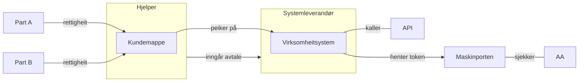

# Virksomheitssystem

Eit virksomheitssystem er ein spesiell type Maskinporten-integrasjon som er tilgjengeleggjort i Altinn3-platformen. Bruksområdet er tiltenkt "målretta" delegering i kunde-leverandør-forhold, typisk, men ikkje begrensa til, scenario der det inngår tre partar:  ein "part" - ein "hjelper" - ein systemleverandør.

# Arkiktektur

Virksomheitssystemet er altså mappa 1:1 til ein spesifikk Maskinporten-integrasjon. For å skape ein abstraksjon mellom virksomheitssytemet, og dei rettane/fullmaktene/delegeringane som systemet skal ha tilgang til, vert det innført eit konsept med "kundemappe" (eller "delegeringsmappe" el.)

# Bruker-reise

1. Ein Systemleverandør tilbyr ulike fagsystem for den profesjonelle marknaden  (T.d "Turboskatt" og "Turbo-MVA") for rekneskapsbyråer.  Systemleverandøren oppretter desse som virksomheitssystem gjennom Altinn, og gir dei naudsynte API-tilgangar som Systemleverandøren har tilgang til (vanlege oauth2 maskinporten scopes, t.d `skatteetaten:mva`).

Sjå [her for detaljert prosess](virksys-opprette.md).

2. Eit regnskapsbyrå (="hjelper") ynskjer so å ta i bruk Turboskatt for eit subsett av eigne kundar ("part").  Rekneskapesbyrået oppretter ei eiga "kundemappe" i Altinn for dette (t.d "Landbruks-seksjonen", "VVS-kundar"). Ein bemyndiga hjå regnskapsbyrået koblar so kundemappa til virksomheitssystemet til Systemleverandøren. I denne prosessen vert det vist ei "samtykke"-side som informerer regnskapsbyrået om kva koblinga innebærer. (Systemleverandøren kan ogso "be om tilgang" og førehands-opprette ei kundemappe for regnskapsbyrået, dersom dette er meir hensiktsmessig).

3. Ein kunde-administrator hjå regnskapsbyrået **videre-delegerer** so aktuelle rettar "R1", "R2", etc... som regnskapsbyrået har fått frå eigne kundar til rett kundemappe.   (Til dømes kan "Reidun Røyrleggjar AS" og "Vidar Ventilasjon AS" puttast i "VVS-kundar", medan "Beate Bonde" skal i landbruks-kundemappa.

4. Virksomheitssystemet skal so gjere eit API-kall som omhandlar data tilhøyrande Reidun Røyrleggjar.   Det autentiserer seg som Systemleverandør opp mot Maskinporten for å hente eit token.  To ulike mønster er her tenkt støtta:

    *  **Virksomheitstoken**.   Dette er ein ny token-type i Maskinporten. Tokenet  inneheld prov som syner at det autentiserte virksomheitsystemet "Turboskatt" har - gjennom "hjelperen" - lov til å opptre på vegne av parten, avgrensa til rettigheita "R1"

    * **Tynne token**. Dette er eit vanleg Maskinporten-token der berre id'en på virksomheitssystemet inngår. Når det aktuelle APIet mottek tokenet, må APIet sjølv gjere eit kall til Altinn Autorisasjon for spørje om virksomheitssystemet har lov til å utføre aktuell API-handling.
    Dette mønsteret er mest passande der legacy-systemer går over til å bruke virksomheitssystem, eller der autorisasjonsreglane er sopassa komplekse at standard "virksomheitstoken" ikkje er tilstrekkeleg.

    Sjå [her for detaljert prosess](virksys-token.md).

### Fleksibilitet

* Dersom Regnskapsbyrået vil bytte systemleverandør, endrar dei berre kundemappa til å peike på den nye leverandøren sitt virksomheitssystem.  Gamal leverandør vil umiddelbart då misse alle rettar, og ikkje lenger få tokens.

* Dersom Kunden (Reidun Røyrleggjar) vil bytte regnskapsbyrå frå Øvre Toten Rekneskapstenester til Nedre Toten Rekneskapstenester, so endrar ho anten i Enhetsregisteret, eller bytter delegeringa av "R1" i Altinn.  Då kaskade-slettast retten frå kundemappa til Øvre Toten, og dei kan ikkje lenger få tokens.
  Kunde-ansvarleg hjå Nedre Toten må - anten manuelt eller automatisert gjennom "innsalgsprosessen" -  videre-delegere rettane til eiga kundemappe.
* Systemleverandør velger fritt om dei vil opprette eitt felles virksomheitssystem for alle rekneskapsbyrå, eller om dei føretrekk å ha ei virksomheitssystem-registrering per byrå ("Turboskatt Øvre Toten", "Turboskatt Nedre Toten")
* Kundemappe-dimensjonen gjer at Rekneskapsbyrået kan bruke ulike systemleverandørar til same type API-tilgang  (Rekneskapsføraren som jobbar med VVS-kundane kan bruke TurboSkatt, medan dei som er i landsbruksavdelinga brukar ein SW frå Landbrukssystemer AS)
* Regnskapsbyrå kan opprette so mange kundemapper dei finn føremålsteneleg.
* Konseptet vil virke fint også innad i same verksemd
  * I store verksemder vil dei truleg ikkje ynskjer at HR-systemet skal kunne ha ret

### Andre  eigenskapar

* Kundemappe kan berre peike på 1 virksomheitssystem

*
* ID på virksomheitssystemet er lik `client_id` i Maskinporten.  
* Virksomheitssystem er ein ny `integration_type` i Maskinporten.
* Virksomheitssystem MÅ bruke ein spesifikk nøkkel til klient-autentisering i Maskinporten
  * dvs. vilkårleg virksomheitssertifikat er ikkje tillatt
  * men det er ikkje forbudt å bruke eitt - og berre eitt - virksomhetssertifikat
* Det er mogeleg å inkludere fleire organisasjonar / rettar i samme virksomheitstoken
* Merk at "scope-delegering" IKKJE kan støttast for denne typen Maskinporten-integrasjonar.

# Teknisk løysing

Klikk på lenke for å sjå detaljar for kvart steg i prosessen:

Steg 1:
