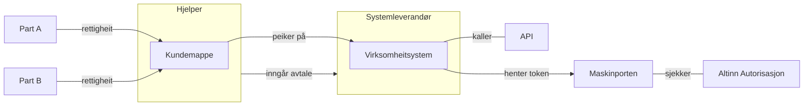

# Virksomheitssystem

Eit virksomheitssystem er ein spesiell type Maskinporten-integrasjon som er tilgjengeleggjort i Altinn3-platformen. Bruksområdet er tiltenkt "målretta" delegering i kunde-leverandør-forhold, typisk, men ikkje begrensa til, scenario der det inngår tre partar:  ein "part" - ein "hjelper" - ein systemleverandør.

# Arkiktektur

Virksomheitssystemet er altså mappa 1:1 til ein spesifikk Maskinporten-integrasjon. For å skape ein abstraksjon mellom virksomheitssytemet, og dei rettane/fullmaktene/delegeringane som systemet skal ha tilgang til, vert det innført eit konsept med "kundemappe" (eller "delegeringsmappe" el.)

# Bruker-reise

1. Ein Systemleverandør tilbyr ulike fagsystem for den profesjonelle marknaden  (T.d "Turboskatt" og "Turbo-MVA"). Systemleverandøren oppretter desse som virksomheitssystem gjennom Altinn, og gjev dei naudsynte API-tilgangar som Systemleverandøren har tilgang til (vanlege oauth2 maskinporten scopes, t.d `skatteetaten:mva`).

    Sjå [her for detaljert prosess](virksys-opprette.md).

2. Eit regnskapsbyrå (="hjelper") ynskjer so å ta i bruk Turboskatt for eit subsett av eigne kundar ("partar").  Rekneskapesbyrået oppretter ei eiga "kundemappe" i Altinn for dette (t.d "Landbruks-seksjonen", "VVS-kundar"). Ein bemyndiga hjå regnskapsbyrået koblar so kundemappa til virksomheitssystemet til Systemleverandøren. I denne prosessen kan det synast ei "samtykke"-side som informerer regnskapsbyrået om kva koblinga innebærer. (Systemleverandøren kan ogso "be om tilgang" og førehands-opprette ei kundemappe for regnskapsbyrået, dersom dette er meir hensiktsmessig).

3. Ein kunde-administrator hjå regnskapsbyrået **videre-delegerer** so aktuelle rettar "R1", "R2", etc... som regnskapsbyrået har fått frå eigne kundar til rett kundemappe.   (Til dømes kan "Reidun Røyrleggjar AS" og "Vidar Ventilasjon AS" puttast i "VVS-kundar", medan "Beate Bonde" skal i landbruks-kundemappa.

4. Virksomheitssystemet skal so gjere eit API-kall som omhandlar data tilhøyrande Reidun Røyrleggjar.  Det autentiserer seg som Systemleverandør opp mot Maskinporten og ber om eit **virksomheitstoken** på vegne av Part.  Virksomheitstokenet er ein ny token-type i Maskinporten som inneheld prov frå Altinn Autorisasjon på at  virksomheitsystemet ("Turboskatt") har - gjennom "hjelperen" - lov til å opptre på vegne av parten, avgrensa til rettigheita "R1"

    Sjå [her for detaljert prosess](virksys-token.md).

### Fleksibilitet

* Rekneskapsbyrået kan legg legge nye kunde-rettar til kundemappa, og desse vil då automatisk kunne brukast av det tilknytta virksomheitssystemet.

* Dersom Regnskapsbyrået vil bytte systemleverandør, endrar dei berre kundemappa til å peike på den nye leverandøren sitt virksomheitssystem.  Gamal leverandør vil umiddelbart då misse alle rettar, og ikkje lenger få tokens.

* Dersom Kunden (Reidun Røyrleggjar) vil bytte regnskapsbyrå frå Øvre Toten Rekneskapstenester til Nedre Toten Rekneskapstenester, so endrar ho anten i Enhetsregisteret, eller bytter delegeringa av "R1" i Altinn.  Då kaskade-slettast retten frå kundemappa til Øvre Toten, og dei kan ikkje lenger få tokens.
  Kunde-ansvarleg hjå Nedre Toten må - anten manuelt eller automatisert gjennom "innsalgsprosessen" -  videre-delegere rettane til eiga kundemappe.

* Kundemappe-dimensjonen gjer at Rekneskapsbyrået kan bruke ulike systemleverandørar til same type API-tilgang for ulike kundegrupper (Rekneskapsføraren som jobbar med VVS-kundane kan bruke TurboSkatt, medan dei som er i landsbruksavdelinga brukar ein SW frå Landbrukssystemer AS)
* Regnskapsbyrå kan opprette so mange kundemapper dei finn føremålsteneleg.

* Systemleverandør vel fritt om dei vil opprette eitt felles virksomheitssystem for alle rekneskapsbyrå, eller om dei føretrekk å ha ei virksomheitssystem-registrering per byrå ("Turboskatt Øvre Toten", "Turboskatt Nedre Toten")
  * TODO: i sær-tilfelle der Parten har delegert samme rettigheit til 2 rekneskapsbyrå, so også nyttar same virksomheitssystem, vil ikkje Autorisasjon kunne automatisk utleie kva for eit rekneskapsbyrå som faktisk  "hjelper"

* Konseptet vil virke fint også innad i same verksemd - det er ikkje eit krav om at part, hjelpe eller systemleverandør er same organisasjon.
  * Store verksemder vil kunne opprette seg eigne virksomheitssystem som dei tildeler  delegerte rettar til - for på denne måten å avgrense kva "altinn-rettar" dei ulike Maskinporten-integrasjonane deira skal kunne få tilgang til.

### Andre  eigenskapar

* Kundemappe kan berre peike på 1 virksomheitssystem

* ID på virksomheitssystemet er lik `client_id` i Maskinporten.  
* Virksomheitssystem er ein ny `integration_type` i Maskinporten.
* Virksomheitssystem MÅ bruke ein spesifikk nøkkel til klient-autentisering i Maskinporten
  * dvs. vilkårleg virksomheitssertifikat er ikkje tillatt
  * men det er ikkje forbudt å bruke eitt - og berre eitt - virksomhetssertifikat
* Merk at "scope-delegering" IKKJE kan støttast for denne typen Maskinporten-integrasjonar.
